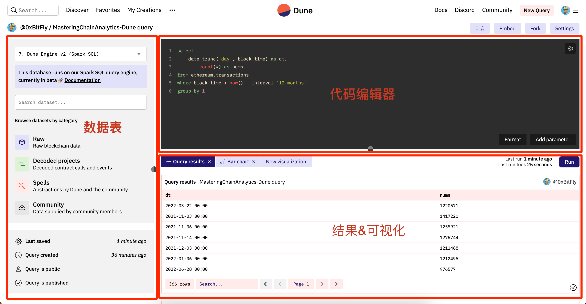
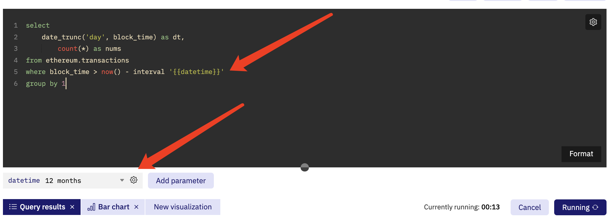

# 2. Dune平台介绍
前文提到从数据栈角度来看，区块链数据产品可以分为`数据源`、`数据开发工具`和`数据app`三类，直接接入数据源成本太高，难度也更大，而数据app又是固定好的，我们要想分析数据，
需要一个开发工作量不大，又能接获取各种数据的平台，这类数据开发工具中，最便捷的便是Dune平台。

[Dune](https://dune.com/)是一个链上的数据分析平台，用户可以在平台上面书写SQL语句，从Dune解析的区块链数据库中筛选出自己需要的数据，并生成对应的图表，组成仪表盘。

本教程的全部查询示例和引用的相关查询（完整的数据看板和第三方账号的查询除外）全部使用Dune SQL查询引擎测试通过。Dune已经宣布2023年内全面过渡到Dune SQL引擎，所以大家直接学习Dune SQL的语法即可。

## 页面介绍

在注册完Dune平台后，平台的主界面如下，具体的各项功能：

- **Discover**：是展示平台的各个方面趋势
  - **Dashboard**：显示当前关注量最多的dashboard，在这个界面，可以左上角的搜索/右侧的搜索框搜索自己感兴趣的关键词，这也是最重要的一个部分，可以点击一个dashboard，查看别人制作的dashboard
  - Queries：显示的是当前关注量最多的query，在这个界面，可以左上角的搜索/右侧的搜索框搜索自己感兴趣的关键词；
  - Wizards：平台中收藏量最高的用户排名；
  - Teams：平台中收藏量最高的团队排名；
- Favorites：
  - Dashboard：自己收藏的dashboard，可以在右侧搜索框搜索
  - Queries：自己收藏的query，可以在右侧搜索框搜索
- **My Creations**：
  - Dashboard：自己创建的dashboard，可以在右侧搜索框搜索，如果你有团队，仪表盘可以在不同的团队中
  - Queries：自己创建的query，可以在右侧搜索框搜索
  - Contracts：自己提交解析的合约，可以在右侧搜索框搜索
- **New Query**：新建一个查询
- 其它
  - Docs：链接到帮助文档
  - Discord：链接到社区讨论组

## 核心功能

### 查询Query

在点击`New Query` 之后，会进入一个新的界面，界面包含三个主要部分：

- 数据表目录：在左侧有一个`数据搜索框`和`数据列表`，展开数据列表后可以看到具体的每一张表。（注：在第一次进入显示的是v1版本的，已弃用，请在上面选择`Dune Engine v2(SparkSQL)`）
  - Raw：记录了各个区块链的原始数据表，主要为区块信息blocks、交易信息transactions、事件日志信息logs和traces表等；目前支持的链有：Ethereum、Polygon、Arbitrum、Solana、Optimism、Gnosis Chain、Avalanche
  - Decoded projects：各个项目/合约的直接解析表，解析出来的表会更加清晰易懂，如果分析具体项目用这里的表会更加合适
  - Spells：是从raw和Decoded projects中提取的综合数据表，比如Dex，NFT，ERC20等等
  - Community：社区用户贡献的数据表

- 代码编辑器：位于右上方的黑色区域，用于写自己的SQL语句，写完可以点击右下角的`Run`执行
- 结果&图表可视化：位于右下方，查询结果会显示在`Query results`，可以依次在后面新建新的子可视化页面

平台的query可以通过分支fork的方式，将别人的query复制到自己的账户下，进行修改和编辑。

**spellbook**

spellbook是Dune平台非常重要的一个数据表，它是由社区用户贡献的一系列加工后的数据表，可以在github页面[duneanalytics/spellbook](https://github.com/duneanalytics/spellbook)贡献自己定义的数据表，dune平台会通过该定义，在后台生成相应的数据，在上图的前端页面中可以直接使用这些定义好的数据表，这些数据表的定义和字段意义可以到这里查看：[https://spellbook-docs.dune.com/#!/overview](https://spellbook-docs.dune.com/#!/overview)

目前spellbook中已经由社区用户贡献了几百张各种各样的表，比如nft.trades, dex.trades, tokens.erc20等等

**参数**

在query中还可以设置一个可变的输入参数，改变查询条件，比如可以设置不同的用户地址，或者设置不同的时间范围，参数设置是以`'{{参数名称}}'`形式嵌入到查询语句中的。

### 图表可视化Visualization

在图表可视化中，Dune平台提供了散点图、柱状图、折线图、饼状图、面积图和计数器以及二维数据表。在执行完查询，得到结果之后，可以选择`New visualization` 创建一个新可视化图，在图中可以选择想要显示的数据字段，可以立刻得到对应的可视化图，图中支持显示多个维度的数据，在图表下方是设置图表样式的区域，包括名称、坐标轴格式、颜色等信息。

 ### 仪表盘Dashboard

上一小节的单个图表可视化，可以在仪表盘中灵活的组合，形成一个数据指标的聚合看板，并附带解释说明，这样可以从一个更加全面的角度去说明。在`Discover`中找到`New Dashboard`可以新建一个仪表盘，在仪表盘中可以添加所有query中生成的图表，并且可以添加markdown格式的文本信息，每个可视化的控件都可以拖拽并调整大小。

### Dune相关资料
- 官方资料
  - [Dune官方文档（包括中文文档）](https://dune.com/docs/)
  - [Discord](https://discord.com/invite/ErrzwBz)
  - [Youtube](https://www.youtube.com/channel/UCPrm9d2hLd_YxSExH7oRyAg)
  - [Github Spellbook](https://github.com/duneanalytics/spellbook)
- 社区教程
  - [Dune 数据看板零基础极简入门指南](https://twitter.com/gm365/status/1525013340459716608)
  - [Dune入门指南——以Pooly为例，做一个NFT看板](https://mirror.xyz/0xa741296A1E9DDc3D6Cf431B73C6225cFb5F6693a/iVzr5bGcGKKCzuvl902P05xo7fxc2qWfqfIHwmCXDI4)
  - [从0到1构建你的Dune V1 Analytics看板（基础篇）](https://mirror.xyz/0xbi.eth/6cbedGOx0GwZdvuxHeyTAgn333jaT34y-2qryvh8Fio)
  - [从0到1构建你的Dune V1 Analytics看板（实战篇）](https://mirror.xyz/0xbi.eth/603BIaKXn7s2_7A84oayY_Fn5XUPh6zDsv2OlQTdzCg)
  - [从0到1构建你的Dune V1 Analytics看板（常用表结构）](https://mirror.xyz/0xbi.eth/uSr336PzXtqMuE_LPBewbJ1CHN2oUs40-TDET2rnkqU)
