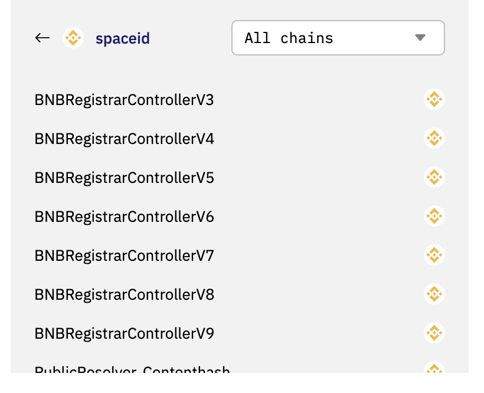

# 如何构建魔法表（Spell）

魔法书（Spellbook）是一个由 Dune 社区共同建设的数据转换层。魔法表（Spell）是Dune团队和社区用户共同参与构建而成的高级抽象视图或表格。

通过构建魔法表，所有Dune社区用户都可以更便捷地完成数据分析。构建魔法有诸多好处。想象以下情形：
- 你有多个查询包含相同的子查询或者CTE
- 你的多个查询中重复使用了非常长的静态数据列表
- 你的某个查询被多次分叉（Fork）或者复制使用
- 你的查询中包含十分复杂的运算逻辑，这个查询可以在其他地方重用

在以上这些情形之一满足时，我们都可以通过构建魔法表的方式，将这个查询转化为一个魔法表。这样可以简化查询SQL逻辑，提高一致性和可维护性，提升数据指标的清晰度。

Dune开源的魔法书项目可自动构建并维护这些魔法表。社区中的任何人都可以贡献魔法书项目中的魔法表。本篇教程我们尝试编写一个简单的魔法表，希望能帮助大家轻松迈出第一步。

## 构建魔法表的基本步骤

用最简单的说法，魔法表其实背后就是一个SELECT查询语句。但是具体构建魔法表的过程会涉及多个方面，多个步骤，必须按照文档指引逐步操作才能顺利完成魔法表构建。

构建魔法表的基本步骤包括：
- **确定数据对象**：根据前述举例的情形，结合自己或者其他社区用户在编写查询时遇到的具体问题和需求，确定要处理构建生成魔法表的数据对象，同时为要输出的魔法表定义模式（Schema）。
- **配置数据源**：数据源是指构建魔法表所依赖的原始数据表和解析数据表。它们必须被定义到YAML文件中。每一个数据源在魔法表中只需定义一次。
- **编写测试**：开始编写魔法表之前先考虑好需要输出的查询结果，针对该结果编写相应的测试。当然如果我们的魔法表只是一个聚合数据的视图，测试也可以放到编写好魔法表后面来添加。
- **编写魔法表**：为每一个要构建的魔法表在其独有的`.sql`文件中通过编写包含一定特殊格式（JINJA模版）的`SELECT`查询来构建魔法表。对魔法表进行编译和测试。
- **提交PR**：编写好魔法表，本地编译成功，手动测试通过后，在github创建新的PR（Pull Request），等待Dune团队的技术人员review和合并。成功合并后，我们就可以在查询编辑器中找到新建的魔法表了。

Dune的在线文档有更详细的说明：[魔法书入门](https://dune.com/docs/zh/spellbook/getting-started/)

## 构建魔法表前的准备工作

开始构建魔法表之前，你需要做一些必备的准备工作，包括熟悉dbt 工具的基本使用，熟悉github 的基本操作（必须有github账号），配置本地工作环境等。详细的环境配置要求和说明在这里：

[💻 准备一些先决条件并且设置好魔法书 dbt](https://dune.com/docs/zh/spellbook/how-to-cast-a-spell/1-do-some-prerequisites%20and-set-up-Spellbook-dbt/)

关于DBT的更多说明信息：

[What is dbt?](https://docs.getdbt.com/docs/introduction)

这里假设你已经按照链接里面的说明配置好相关软件。且已经在github上通过分叉（Fork）将Dune魔法书存贮库（https://github.com/duneanalytics/spellbook）分叉到了你自己的github账号下。接下来的重点步骤简要说明。我本地是Mac操作系统，所以这里仅以Mac环境为例。如果你用的是Windows环境，使用过程遇到任何问题，请在群里提问。

使用`git clone`命令将分叉的存贮库克隆到本地。在本地新建一个工作目录。进入该目录，使用下面的命令进行Clone（地址从github上你自己分叉的存贮库页面复制，如下图所示）：

```
git clone git@github.com:springzh/spellbook.git
```


克隆完成后，工作目录中会看到一个新的`spellbook`子目录。进入该子目录。

```
cd spellbook
```

如果之前没有运行过`pipenv install`来创建本地的pipenv环境，则需要执行安装。

```
pipenv install
```

如果上面的命令执行出错，可以尝试：

```
sudo -H pip install -U pipenv
```

如果上述命令返回错误：

```
pipenv install returns warning LANG, warning Python 3.9 not found
```

那么可以再次尝试指定Python 版本的方式来安装：

```
pipenv install --python 3.9.13
```

可以使用这个命令来确认你本地安装的Python版本：

```
python3 –version
```

pipenv环境安装好之后，现在就可以启动它了。

```
pipenv shell
```

接下来，运行`dbt init`命令来初始化dbt。该命令以交互式方式引导我们完成dbt的初始化，前面“准备一些先决条件并且设置好魔法书 dbt”链接里有详细的说明。

```
dbt init
```

当我们编写好魔法表后，或者在每次我们对魔法表的相关文件进行了任何修改之后，我们使用`dbt compile`来编译整个dbt项目，重新生成魔法表的SQL。

为避免混淆，再次列一下主要的步骤：

**第一次初始化并运行的执行步骤**：

```
# 安装pipenv 环境
pipenv install

# 启动 pipenv 环境
pipenv shell 

# 初始化 dbt
dbt init 

# 添加、修改文件

# 编译 dbt
dbt compile
```

**已经完成初始化之后的后续日常运行的执行步骤**：

```
# 启动 pipenv 环境
pipenv shell 

# 添加、修改文件

# 编译 dbt
dbt compile
```

在编写、调试一个新的魔法表过程中，我们可能需要反复调整修改相关的文件，可以多次执行dbt compile。如果编译出错，根据错误信息进行修改。编译成功，则复制生成的SQL语句到Dune上进行实际的查询测试，确认SQL工作正常且输出结果符合预期。

## 本教程要构建的魔法表

本教程的目的是让大家可以通过很简单的例子快速上手构建魔法表。之前在BNB链上的Space ID刚推出域名注册时，我曾经创建了一个SpaceID数据看板（[SpaceID - BNB Domain](https://dune.com/sixdegree/bnb-domain-spaceid)）。记得当时Space ID只是小范围开放Mint权限，用户对相关的Mint规则提出了很多反馈建议。SpaceID项目方针对这些反馈建议也不断对其智能合约进行了完善升级，短短几天时间内，域名注册的合约发布了5个主要版本，从 V3 到 V7。这就导致了一个问题，当我们要汇总当前已经被注册的所有SpaceID域名数据时，就必须分别从这些不同版本智能合约的事件日志表来查询数据并自行使用“Union All”的方式合并到一起。所以大家如果去看我这个数据看板的查询源代码，里面的查询基本都有一个很长的CTE定义来汇总合并来自不同版本合约的域名注册事件。例如：[https://dune.com/queries/1239514/2124307](https://dune.com/queries/1239514/2124307)。为了保持更新，我不得不多次对相关的查询逐个进行修改，将新的合约版本的数据包括进去。实际上，目前SpaceID 已经有V8和V9的域名注册合约版本，而我这个看板并未包括它们的数据，已经过时。如果有其他用户Fork了我的查询并且做了一些调整，那么很不幸，他们的查询也过时了。



对于这种情况，如果我们将域名注册事件构建为一个魔法表（实际上是一个视图），那么所有的查询都可以直接基于这个魔法表来编写。当有新的智能合约版本发布时，我们只需要修改更新魔法表的定义，重新提交PR去review。提交的PR被审核通过并且合并之后，魔法表的数据就自动更新了。所有使用这个魔法表的查询都不需要任何改动。反之，在没有魔法表的情况下，我的这些查询，包括其他人Fork这些查询生成的新查询，都必须逐个修改。从这里我们可以充分看到构建魔法表的好处。

所以，我们这里要做的就是针对`bnb`区块链上的`spaceid`项目，构建一个包括全部Space ID域名注册信息的魔法表。

## 创建目录结构和文件

确定了要制作什么魔法表之后，我们就可以着手开始工作了。使用git时，总是在工作分支中进行开发是一个好习惯，建议大家都遵循这个方式。我们在已经克隆到本地的spellbook 存贮库中新建一个工作分支：

```
git checkout -b add_bnb_spaceid
```

现在我们就自动切换到了`add_bnb_spaceid`这个新建的git 工作分支下。可以开始创建魔法表需要的目录结构和文件。

项目类型的魔法表，都按“项目名称/区块链名称”的结构存储在 /spellbook/models 目录中。名称全部使用小写字母，单词之间用 `_` 分隔。例如：`/spellbook/models/[project_name]/[blockchain_name]`。我们要构建魔法表的项目名称是`spaceid`，区块链是`bnb`，所以我们这个魔法表的完整目录结构就是：`/spellbook/models/spaceid/bnb/`。

请进入`models`目录，在其下创建子目录`spaceid`，再进入这个新建的目录中创建`bnb`子目录。

魔法表文件命名如下：
- 对于模式文件：[project_name]_[blockchain]_schema.yml
- 对于依赖源文件：[project_name]_[blockchain]_sources.yml
- 对于魔法表的SQL文件：[project_name]_[blockchain]_[spell_name].sql

其中，`spell_name`是我们想创建的魔法表的名称。我们使用`registrations`作为名称。

所以我们需要在`spaceid/bnb/`目录中分别创建以下3个对应的文件（文件内容先保持为空，稍后我们逐个讲解）：
- spaceid_bnb_schema.yml
- spaceid_bnb_sources.yml
- spaceid_bnb_registrations.sql

现在的目录和文件结构如下：


参考文档：[🛣️ 为 SQL、模式和源文件设置文件结构](https://dune.com/docs/zh/spellbook/how-to-cast-a-spell/3-set-up-your-file-structure-for-SQL-schema-and-source-files/)

## 定义依赖源文件

我们这里只需要用到SpaceID项目到目前为止已发布的合约`RegistrarController`的七个不同版本的已解析表。这些表位于`spaceid_bnb` 模式之下。我们的依赖源文件`spaceid_bnb_sources.yml`的定义如下：

```yml
version: 2

sources:
  - name: spaceid_bnb
    description: "bnb decoded tables related to SpaceId contract"
    freshness: # default freshness
      warn_after: { count: 12, period: hour }
      error_after: { count: 24, period: hour }
    tables:
      - name: BNBRegistrarControllerV3_evt_NameRegistered
        loaded_at_field: evt_block_time
      - name: BNBRegistrarControllerV4_evt_NameRegistered
        loaded_at_field: evt_block_time
      - name: BNBRegistrarControllerV5_evt_NameRegistered
        loaded_at_field: evt_block_time
      - name: BNBRegistrarControllerV6_evt_NameRegistered
        loaded_at_field: evt_block_time
      - name: BNBRegistrarControllerV7_evt_NameRegistered
        loaded_at_field: evt_block_time
      - name: BNBRegistrarControllerV8_evt_NameRegistered
        loaded_at_field: evt_block_time
      - name: BNBRegistrarControllerV9_evt_NameRegistered
        loaded_at_field: evt_block_time
```

在我们定义的依赖源文件中：
1. `version` 总是为`2`。
2. `name` 指定依赖源数据表的模式（Schema名称）。我们可以在Dune上新建查询，搜索相关的表，将表名添加到查询编辑器中，`.`符号左边的部分就是表的模式名称。比如`spaceid_bnb.BNBRegistrarControllerV3_evt_NameRegistered` 表的模式名称就是`spaceid_bnb`。
3. `freshness` 这个设置用于确认魔法表数据的自动更新，如果超过指定时间未成功更新，则会在使用魔法表时发出警告或显示错误（我自己尚未遇到过此类错误，所以也可能错误只发送给维护魔法表模块的工作人员）。保持相同的默认设置即可。这里的设置对后续`tables`下的所有数据来源表都有效。当然也可以对单个表添加此项设置。
4. `tables`部分逐个列出我们需要用到的数据来源表。这些表需要都归属于上面模式名称指定的同一个模式。如果有属于不同模式的表，我们就需要在同一个文件中单独再添加一段相同的结构的定义。可参考其他已有的魔法表的模式文件定义。
  - `name` 设置表的名称。这里不要包括模式名称。
  - `loaded_at_field` 指定用于检查验证最后几行数据的加载时间，需要指定一个时间戳类型字段。这个配合`freshness` 设置确保魔法表数据的正常更新。


参考文档：
- [📙 识别和定义依赖源](https://dune.com/docs/zh/spellbook/how-to-cast-a-spell/4-identify-and-define-sources/)
- [数据源](https://dune.com/docs/zh/spellbook/getting-started/data-sources/)

## 定义模式文件

模式文件`spaceid_bnb_schema.yml`提供要创建的魔法表的名称、字段、描述等信息，已经相应的配置信息。

```yml
version: 2

models:
  - name: spaceid_bnb_registrations
    meta:
      blockchain: bnb
      project: spaceid
      contributors: [springzh]
    config:
      tags: ['bnb','spaceid','name','registrations']
    description: >
       SpaceID V3, V4, V5, V6, V7, V8 & V9 Name Registered on BNB
    columns:
      - &version
        name: version
        description: "Contract version"
      - &block_time
        name: block_time
        description: "UTC event block time"
      - &name
        name: name
        description: "Name of the space ID"
        tests:
          - unique
      - &label
        name: label
        description: "Label of the space ID"
      - &owner
        name: owner
        description:  "Owner of the space ID"
      - &cost
        name: cost
        description:  "Cost spent to register the space id"
      - &expires
        name: expires
        description:  "Name expires date and time in unix timestamp format"
      - &contract_address
        name: contract_address
        description:  "Contract address that called to register the space id"
      - &tx_hash
        name: tx_hash
        description:  "Transaction hash"
      - &block_number
        name: block_number
        description: "Block number in which the transaction was executed"
      - &evt_index
        name: evt_index
        description: "Event index"
```

SpaceID的多个版本的`NameRegistered`事件表结构完全相同，所以我们的工作比较简单，使用其中一个表的结构做参考，就可以定义出我们的模式文件。为了区分域名注册的来源，我们添加一个`version`字段，保存'v3'、'v4'这样的智能合约版本信息。

因为域名是唯一的，我们给`name`字段添加了一个唯一性的测试定义。编译时会自动生成一个对应的测试SQL，用于确保魔法表数据中不存在重复值。

`&field_name`定义字段名称。同一个字段名称第一次出现时，需要带有“&”前缀。后续在同一个文件中的其他表的字段定义可以使用`*field_name`来引用，这样可以让代码更简洁。

## 编写魔法表视图的SQL语句

接下来我们进入魔法表最关键的SQL编写部分。打开`spaceid_bnb_registrations.sql`文件，输入如下内容（做了部分省略）：

```sql
{{config(alias='registrations',
        post_hook='{{ expose_spells(\'["bnb"]\',
                                    "project",
                                    "spaceid",
                                    \'["springzh"]\') }}')}}
SELECT 'v3' as version,
    evt_block_time as block_time,
    name,
    label,
    owner,
    cast(cost as double) as cost,
    cast(expires as bigint) as expires,
    contract_address,
    evt_tx_hash as tx_hash,
    evt_block_number as block_number,
    evt_index
FROM {{source('spaceid_bnb', 'BNBRegistrarControllerV3_evt_NameRegistered')}}

UNION ALL

SELECT 'v4' as version,
    evt_block_time as block_time,
    name,
    label,
    owner,
    cast(cost as double) as cost,
    cast(expires as bigint) as expires,
    contract_address,
    evt_tx_hash as tx_hash,
    evt_block_number as block_number,
    evt_index
FROM {{source('spaceid_bnb', 'BNBRegistrarControllerV4_evt_NameRegistered')}}

-- 此处省略了 V5 - V8的代码部分

UNION ALL

-- There are some records in v9 table are duplicated with those in v5 table. So we join to exclude them
SELECT 'v9'                       as version,
       v9.evt_block_time          as block_time,
       v9.name,
       v9.label,
       v9.owner,
       cast(v9.cost as double)    as cost,
       cast(v9.expires as bigint) as expires,
       v9.contract_address,
       v9.evt_tx_hash             as tx_hash,
       v9.evt_block_number        as block_number,
       v9.evt_index
FROM {{source('spaceid_bnb', 'BNBRegistrarControllerV9_evt_NameRegistered')}} v9
LEFT JOIN {{source('spaceid_bnb', 'BNBRegistrarControllerV5_evt_NameRegistered')}} v5
    ON v9.name = v5.name
WHERE v5.name is null
```

说明如下：
- 开头的`config`对魔法表做一些配置说明，非常关键。请总是保持相同的格式。也请注意单引号双引号嵌套时的转义处理。其中，`alias`指定魔法表的别名，这个就是用户在查询编辑器中用到的魔法表名称。建议使用跟在schema中定义的名称。`post_hook` 配置魔法表构建完成发布时的附加操作。`expose_spells`设置将魔法表展示到查询编辑器中（其他用户可以搜索找到）。它的参数按顺序分别表示，适配的区块链（数组），魔法表的类型（项目类型还是行业类型），项目或行业的命名，贡献者列表（数组）。具体到我们这个魔法表，就是bnb区块链，project类型，名称是spaceid，贡献者写你自己的github账号名称。
- 主体部分就是一个完整的SELECT查询语句。跟我们平常编写的查询语句的不同之处在于，我们需要使用特殊的JINJA模版语法来引用数据源表。例如`{{source('spaceid_bnb', 'BNBRegistrarControllerV9_evt_NameRegistered')}}` 就指向我们在`spaceid_bnb_sources.yml`文件中定义的`BNBRegistrarControllerV9_evt_NameRegistered`表。
- 在提交PR给Dune Review之后，我们收到测试反馈，域名`name`字段的唯一性检查测试失败。经过检查确认，发现是V9版本的表中包含了部分V5中的记录，并且来源于相同的交易记录（evt_tx_hash值相同）。这里的原因尚未确定，不过我们就对V9部分的查询做了调整，排除掉那些已经在V5中的记录。

参考文档：
- [🎨 配置别名和物化策略](https://dune.com/docs/zh/spellbook/how-to-cast-a-spell/7-configure-alias-and-materialization-strategy/)
- [🖋️ 将您的魔法表写成 SELECT 语句](https://dune.com/docs/zh/spellbook/how-to-cast-a-spell/6-write-your-spell-as-SELECT-statement/)

写好查询语句后，我们可以先使用`dbt compile`尝试编译。如果返回错误，请针对性修改后再次编译，确保编译成功。

在我们的PR提交Review之后，收到了评审反馈，建议将视图的物化策略设置为增量更新（incremental），所以对于上面的查询SQL，分别对其头部的`config`部分和每一个子查询部分增加有关增量更新的调整。调整后的示例如下：

```sql
{{
    config(
        alias='registrations'
        ,materialized = 'incremental'
        ,file_format = 'delta'
        ,incremental_strategy = 'merge'
        ,unique_key = ['name']
        ,post_hook='{{ expose_spells(\'["bnb"]\',
                                    "project",
                                    "spaceid",
                                    \'["springzh"]\') }}'
    )
}}

SELECT 'v3'                    as version,
       evt_block_time          as block_time,
       name,
       label,
       owner,
       cast(cost as double)    as cost,
       cast(expires as bigint) as expires,
       contract_address,
       evt_tx_hash             as tx_hash,
       evt_block_number        as block_number,
       evt_index
FROM {{source('spaceid_bnb', 'BNBRegistrarControllerV3_evt_NameRegistered')}}

WHERE evt_block_time >= date_trunc("day", now() - interval '1 week')


UNION ALL

-- 此处省略
```

添加了增量更新相关的配置和条件控制后，在增量更新模式下（即``），每次只会对近一周内的数据进行查询，查询到的新数据将会被合并到保存视图数据的物理文件中，因为使用了`incremental_strategy = 'merge'`策略，已存在的记录会被忽略。

## 将新模型添加到 dbt_project.yml 文件

接下来我们需要修改位于spellbook根目录下的`dbt_project.yml`文件，将我们的魔法表加入其中。

```
    spaceid:
      +schema: spaceid
      bnb:
        +schema: spaceid_bnb
```

这里我们分吧指定了项目名称和项目的模式名称，已经项目对应的区块链名称和在该区块链下的模式名称。通过这样的层级结构，我们可以进行分层抽象处理，先针对每个部署在不同区块链上的项目构建魔法表，然后可以进一步将多个区块链上的相同项目的魔法表进一步构建为整个项目层级的魔法表。具体的例子可以参考opensea或者uniswap相关的魔法表。

可以再次使用`dbt compile`尝试编译，确认编译成功。

参考文档：
- [🎨 配置别名和物化策略](https://dune.com/docs/zh/spellbook/how-to-cast-a-spell/7-configure-alias-and-materialization-strategy/)

## 编写测试

我们需要确保生成的魔法表数据是完整且准确的，通过编写合理的测试可以达到这个目的。在`spellbook/test`目录下创建新的目录路径`spaceid/bnb`，进入bnb子目录，在其中创建一个文件`spaceid_registrations_test.sql`，文件内容如下：

```sql
WITH unit_tests AS (
    SELECT COUNT(*) as count_spell
    FROM {{ ref('spaceid_bnb_registrations') }} AS s
    WHERE version = 'v7'
),

spaceid_v7_registration as (
    SELECT COUNT(*) as count_event_table
    FROM {{source('spaceid_bnb', 'BNBRegistrarControllerV7_evt_NameRegistered')}}
)
SELECT 1
FROM unit_tests
JOIN spaceid_v7_registration ON TRUE
WHERE count_spell - count_event_table <> 0
```

我们在这个测试中，使用`{{ ref('spaceid_bnb_registrations') }}` 的形式来引用生成的魔法表。首先，从生成的魔法表中查出V7版本的所有记录数。然后我们再使用`{{source('spaceid_bnb', 'BNBRegistrarControllerV7_evt_NameRegistered')}}，从对应的V7解析表查询记录数量。最后检查这两个CTE返回的记录数量是否相同。如果不同，则会返回一行结果记录。一个成功的测试必须不返回任何结果集，查询返回任意记录则表示测试失败。

参考文档：[如何为您的魔法编写单元测试？](https://dune.com/docs/zh/spellbook/getting-started/tests/)

## 编译与调试

当我们编辑并保存了测试文件之后，需要再次使用`dbt compile`进行编译，修改提示的任何错误，确认编译成功。

此时，我们还需进行一个非常重要的步骤，复制编译生成的查询代码，在Dune上进行实际的测试验证。

编译成功时，在`spellbook`目录下会生成`target`子目录，我们可以在其中找到`compiled/spellbook/models/spaceid/bnb`子目录，其中会有一个`spaceid_bnb_registrations.sql`文件。这个就是我们正在构建的魔法表背后的视图定义SQL。目录下还有一个`spaceid_bnb_schema.yml`的子目录，里面保存的是根据模式定义自动生成的测试，这部分我们可以忽略。

我们对`spaceid_bnb_registrations.sql`文件进行手动测试。因为数据量很大，并不适合直接运行文件里面的SQL返回所有记录。我们可以复制查询文件的全部内容，将其放到一个CTE定义中，然后针对该CTE进行只返回少量数据的查询。

```sql
with view_registration as (
SELECT 'v3'                    as version,
       evt_block_time          as block_time,
       name,
       label,
       owner,
       cast(cost as double)    as cost,
       cast(expires as bigint) as expires,
       contract_address,
       evt_tx_hash             as tx_hash,
       evt_block_number        as block_number,
       evt_index
FROM spaceid_bnb.BNBRegistrarControllerV3_evt_NameRegistered

-- 此处省略后续代码

)

select * from view_registration
limit 1000
```

完整的手动测试查询代码：[https://dune.com/queries/2020131](https://dune.com/queries/2020131)

这一步测试的主要目的是确保编译生成的SQL语句在Dune上可以正常运行。当然你可以修改最后的输出查询语句，做更多的手动测试。

## 提交PR

现在我们已经处理好新的魔法表并且完成了本地测试。已经准备好将新增和修改过的文件内容提交到Github代码库中，向Dune提交PR。

我们首先将本地新建和修改的代码文件添加并提交到本地git 存贮库，然后将本地的分支推送到远程Github存贮库中：

```
# 查看并确认新增或修改过的文件及目录
git status

# 将所有新增和修改过的文件加入提交
git add .

# 提交到本地git存贮库
git commit -m 'Add spaceid view'

# 将本地存贮库分支推送到远程Github库中
git push -u origin add_bnb_spaceid

```

上面的推送命令中的参数部分`-u origin add_bnb_spaceid`仅在第一次推送时才需要。当我们完成第一次推送后，如果后续又对相关文件做了修改，则在提交到本地git库中后，推送到远程时使用的命令需要改成：

```
git push
```

然后，我们打开github网站，进入我们的个人账号下的`spellbook`存贮库页面。可以看到提示信息，告诉我们有新的分支`add_bnb_spaceid`提交了最新修改，可以为其创建Pull Request（即PR)。点击创建PR按钮，则会进入PR创建页面。

在这个PR页面中，我们需要编辑输入一下内容，同时确认我们已经按照文档指导完成了相应的检查和测试工作。这个内容编辑器支持Markdown语法，`[ ]`将会输出一个未勾选的checkbox，`[x]`则会输出一个勾选状态的checkbox。我们逐一调整这些选项，确认已完成了相应的步骤和处理。

我们还需要针对这个PR所新增或者修改的Spell提供一些简要的说明信息，以方便审核人员可以更容易了解其中涉及的内容。


提交PR后，我们需要等待相关人员Review并提供反馈。同时，需要留意来自Github的邮件通知。其中一些通知信息可以忽略，比如关于`dbt slim ci (in beta) / dbt-test`的。主要需要注意的是Review人员提供的反馈点评。如果有需要修改的内容，就要及时修改、测试、提交修改、推送到Github（此时修改会自动出现在已经创建的PR下，无需再次创建新的PR），并等待再次Review。

如果所有的修改都顺利通过了Review，那么我们的PR就会被合并到spellbook主分支，并被部署到Dune正式站点。部署完成后，我们就可以在查询编辑器中搜索找到并使用我们自己构建的魔法表了。大功告成！

## 补充说明与特别鸣谢

注意：截止到本文发稿时，我们的这个PR还在Review过程中，尚未被批准通过。所以后续可能还会根据反馈建议进行修改调整。这个PR的编号是2725，大家可以通过PR页面来了解相关的细节。

PR的Github链接：[Add BNB spaceid view](https://github.com/duneanalytics/spellbook/pull/2725)

特别鸣谢社区成员 @hosuke (Dune: [https://dune.com/hosuke](https://dune.com/hosuke)）及时协助PR的Review，提供问题反馈和完善建议，并帮忙修改了魔法表的物化策略部分。

## SixdegreeLab介绍

SixdegreeLab（[@SixdegreeLab](https://twitter.com/sixdegreelab)）是专业的链上数据团队，我们的使命是为用户提供准确的链上数据图表、分析以及洞见，并致力于普及链上数据分析。通过建立社区、编写教程等方式，培养链上数据分析师，输出有价值的分析内容，推动社区构建区块链的数据层，为未来广阔的区块链数据应用培养人才。

欢迎访问[SixdegreeLab的Dune主页](https://dune.com/sixdegree)。

因水平所限，不足之处在所难免。如有发现任何错误，敬请指正。
